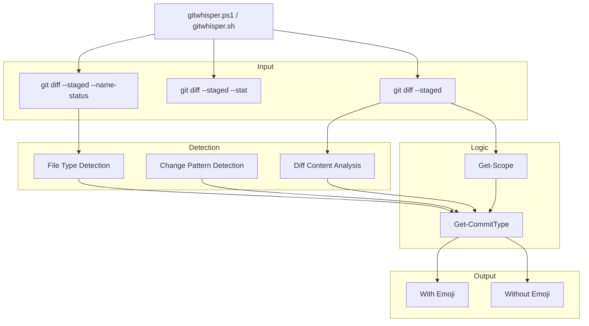
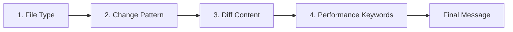

<p align="center">
  
</p>

<p align="center">
  <strong>The script whispers the right commit message.</strong>
</p>

<p align="center">
  
  
  
  
</p>

<p align="center">
  <a href="#preview">Preview</a> ·
  <a href="#features">Features</a> ·
  <a href="#quick-start">Quick Start</a> ·
  <a href="#commands">Commands</a> ·
  <a href="#changelog-generator">Changelog</a> ·
  <a href="#automated-release">Release</a> ·
  <a href="#configuration">Configuration</a>
</p>

---

GitWhisper is a cross-platform tool that analyzes your `git diff` and auto-generates **[Conventional Commits](https://www.conventionalcommits.org/en/v1.0.0/)** messages with **gitmoji** support. It detects file types, infers scope from folder structure, and produces specific descriptions by reading the actual diff content.

## Preview

```
PS C:\MyProject> gitwhisper

=== Changes detected ===

 src\auth\Login.js   | 12 ++++++++++
 src\api\user.js     |  5 +++--

=== Choose your commit message ===

  [1] ✨ feat(auth): adds Login component
  [2] feat(auth): adds Login component
  [3] ✨ feat(auth): adds Login import and handleSubmit
  [4] feat(auth): adds Login import and handleSubmit
  [0] Cancel

  Select (0-4): 1

  Committing: ✨ feat(auth): adds Login component

  Push to remote? (y/n): y

  Pushing...
  Pushed successfully!
```

## Features

| Feature | Description |
|---|---|
| Type Detection | Auto-detects feat, fix, docs, style, refactor, perf, test, build, ci, chore |
| Branch Conventions | Detects the commit type from the branch name prefix (`feat/`, `fix/`, `docs/`, ...) |
| Scope Inference | Reads folder structure to determine scope (auth, api, ui, etc.) |
| Specific Descriptions | Analyzes diff content for imports, functions, classes, hooks, routes |
| Self-Noise Filter | Ignores literal strings from GitWhisper's own files (`gitwhisper.*`) when analyzing the diff, so script edits produce clean messages |
| Gitmoji Support | Generates both emoji and non-emoji versions |
| Automated Release | Bumps version, updates CHANGELOG.md, creates a `vX.Y.Z` tag, and optionally publishes a GitHub Release |
| Polished Release Notes | Groups commits by scope, links PRs `(#123)`, and thanks contributors by username |
| Undo Commit | Soft or mixed reset of the last commit via `gitwhisper undo` |
| Staged Only | Only analyzes what's staged (what will be committed) |
| PS 5.1 Compatible | Unicode escapes for full Windows PowerShell compatibility |
| Cross-Platform | PowerShell for Windows, Bash for Linux/macOS |

| 50/72 Rule | Enforces conventional commit summary length |

## Quick Start

### 1. Install globally

Clone the repository and run the install script. This adds functions to your shell profile so you can use GitWhisper from **any project** without copying scripts.

**Windows (PowerShell):**

```powershell
git clone https://github.com/youruser/GitWhisper.git
cd GitWhisper
.\install.ps1
```

**Windows — graphical installer:**

```powershell
powershell -ExecutionPolicy Bypass -File .\install-gui.ps1
```

The GUI installer has two visualizer tabs: **Profile preview** (shows exactly what will be added to or removed from your profile and bin directory before you apply it) and **GitWhisper preview** (type conventions + a live message generator that runs `gitwhisper suggest` against a temporary repository).

**Windows — desktop app (Electron):**

```powershell
cd desktop
npm install
npm start        # run the app from source
npm run dist     # build a portable .exe → desktop\dist\GitWhisper-Installer-0.3.0.exe
```

Or just run the pre-built portable exe — no install required:

```
desktop\dist\GitWhisper-Installer-0.3.0.exe
```

The desktop app mirrors the WPF installer: pick a profile and integration type, see a live preview of the block that will be appended, install/uninstall, and set up a git project (hooks + `.gitwhisperconfig`) — plus a GitWhisper preview tab that generates a real suggestion from a temporary repository.

**Linux / macOS (Bash):**

```bash
git clone https://github.com/youruser/GitWhisper.git
cd GitWhisper
chmod +x install.sh
./install.sh
```

Restart your terminal after installation.

#### Non-interactive install

All three installers accept flags for scripting/CI:

```bash
./install.sh --yes --profile ~/.bashrc --type function        # Bash
powershell -File install.ps1 -Yes -ProfilePath $PROFILE        # PowerShell
```

| Flag | install.sh | install.ps1 / install-gui.ps1 | Meaning |
|------|-----------|-------------------------------|---------|
| Help | `--help` | `-Help` | Show help |
| Check | `--check` | `-Check` | Show detection status, no changes |
| Non-interactive | `--yes` | `-Yes` | Accept defaults, no prompts |
| Profile | `--profile PATH` | `-ProfilePath PATH` | Profile file to modify |
| Integration | `--type function\|bin` | `-Type function\|bin` | `function` (in profile) or `bin` (wrapper in bin dir) |
| Bin directory | `--bin-dir PATH` | `-BinDir PATH` | Only for `bin` type |
| Uninstall | `--uninstall` | `-Uninstall` | Remove GitWhisper from the profile |

The interactive installers offer a menu with: install/reinstall, change install options (profile, integration type, bin directory), set up a project (hooks + `.gitwhisperconfig`), uninstall, and quit.

### Desktop App (Electron)

A graphical installer built with [Electron](https://www.electronjs.org/) that does everything the terminal wizards do, without typing commands.

#### Run it

| Way | Command |
|---|---|
| Pre-built portable exe | `desktop\dist\GitWhisper-Installer-0.3.0.exe` |
| From source | `cd desktop; npm install; npm start` |
| Build your own exe | `cd desktop; npm install; npm run dist` |

The build produces `desktop\dist\GitWhisper-Installer-0.3.0.exe`, a self-contained portable executable (no installation needed — it stores its state in the app folder and writes only to your profile and `~/.gitwhisper/`).

#### How to use it

1. **Profile file** — path to your shell profile. On Windows it defaults to `Documents\WindowsPowerShell\Microsoft.PowerShell_profile.ps1`; on Linux/macOS use `~/.bashrc` or `~/.zshrc`. Use **Browse...** to pick a file.
2. **Integration** — choose how `gitwhisper` becomes available:
   - **Function in profile** *(default)* — appends a `gitwhisper` function to the profile.
   - **Executable in bin directory** — creates `gitwhisper.cmd` + `gitwhisper` wrappers in a bin folder and adds it to `PATH` from the profile. The **Bin directory** field becomes editable.
3. **Profile preview tab** — shows exactly what will be appended to (or removed from) the profile, and whether anything is already installed. No changes happen until you click a button.
4. **Install** — copies the scripts to `~/.gitwhisper/`, replaces any existing GitWhisper block, and appends the new one. Restart your terminal afterwards (or run `. $PROFILE`).
5. **Uninstall** — removes the GitWhisper block from the profile and deletes the bin wrappers (if any).
6. **Set up project...** — pick a git repository and configure it: write `.gitwhisperconfig` (emoji, default message format, hook toggles) and run the `init` hook installation.
7. **GitWhisper preview tab** — a cheat-sheet of Conventional Commit types + gitmoji, and a **Generate example message** button that runs `gitwhisper suggest` against a temporary git repository for a real, live suggestion.

#### Notes

- The scripts are copied to `~/.gitwhisper/` (not linked to the repo folder), so the app keeps working even if you move or delete the GitWhisper clone.
- The portable exe is built unsigned (`signAndEditExecutable: false`). SmartScreen may show a warning on first run — click *More info → Run anyway*.
- Headless test for the main-process logic: `node desktop/test-main.js` (30 checks: install/uninstall/replace/bin-dir detection/project setup/demo).

### 2. Use in any project

```powershell
cd C:\MyProject
git add .
gitwhisper
# Select 1-4, then confirm push
```

> **Note:** Install once, use everywhere. Run `git pull` in the GitWhisper folder to get updates — no reinstall needed.

## Undo Last Commit

Quickly undo the last commit with a simple interactive menu.

### PowerShell

```powershell
gitwhisper undo              # unified command
.\gitwhisper.ps1 undo        # if running directly
```

### Bash

```bash
gitwhisper undo              # unified command
./gitwhisper.sh undo         # if running directly
```

### Reset Options

| Option | Description |
|---|---|
| **Soft reset** | Undoes the commit, keeps changes **staged** (ready to re-commit) |
| **Mixed reset** | Undoes the commit, **unstages** changes (files remain modified) |

```
=== Undo last commit ===

  Last commit: ✨ feat(auth): adds Login component

  [1] Soft reset  — keeps changes staged
  [2] Mixed reset — unstages changes (keeps files)
  [0] Cancel

  Select (0-2): 1

  Undone (soft). Changes are still staged.
```

## Commands

### Global function (after install)

| Command | Description |
|---|---|
| `gitwhisper` | Unified command: `gitwhisper [commit\|undo\|amend\|changelog\|release\|pr\|help]` |

### Direct script usage

| Command | Description |
|---|---|
| `.\gitwhisper.ps1` / `./gitwhisper.sh` | Generate commit message and commit interactively |
| `.\gitwhisper.ps1 undo` / `./gitwhisper.sh undo` | Undo last commit (soft or mixed reset) |
| `.\gitwhisper.ps1 changelog` / `./gitwhisper.sh changelog` | Generate CHANGELOG.md from commit history |
| `.\gitwhisper.ps1 changelog -SinceTag` / `./gitwhisper.sh changelog --since-tag` | Generate only since last tag |
| `.\gitwhisper.ps1 changelog -Limit 100` / `./gitwhisper.sh changelog --limit 100` | Limit to last 100 commits |
| `.\gitwhisper.ps1 release` / `./gitwhisper.sh release` | Create release: bump version, update CHANGELOG.md, commit and tag |
| `.\gitwhisper.ps1 release -Push` / `./gitwhisper.sh release --push` | Automatically push commit and tag after release |
| `.\gitwhisper.ps1 release -Github` / `./gitwhisper.sh release --github` | Also publish a GitHub Release via the `gh` CLI |
| `.\gitwhisper.ps1 release -Minor` / `./gitwhisper.sh release --minor` | Force a minor bump (`-Major` / `-Patch` also supported) |
| `.\gitwhisper.ps1 release -Version 1.2.3` / `./gitwhisper.sh release --version 1.2.3` | Use an explicit version |

## Architecture



### Detection Priority



| Priority | Detection | Example |
|---|---|---|
| 1 | File type | `.test.js` → test, `Dockerfile` → build |
| 2 | Change pattern | Added only → feat, modified only → fix |
| 3 | Diff content | `import { Login }` → adds Login import |
| 4 | Performance | `memo`, `lazy`, `cache` → perf |

## Commit Type Detection

| Type | Emoji | Detected From | Example |
|---|---|---|---|
| `feat` | ✨ | New files added | `feat(auth): adds Login component` |
| `fix` | 🐛 | Modified files, error handling | `fix(api): adds error handling in user.js` |
| `docs` | 📝 | `.md`, `.txt`, `.rst` files | `docs: adds README.md` |
| `style` | 💄 | `.css`, `.scss`, `.less` files | `style: fixes formatting in header.css` |
| `refactor` | ♻️ | Mixed add+modify+delete | `refactor: adds X and removes Y` |
| `perf` | ⚡ | Performance keywords | `perf: adds memo and lazy optimization` |
| `test` | ✅ | Test files (`.test.`, `.spec.`) | `test: adds tests for utils.test.js` |
| `build` | 🔧 | `package.json`, `Dockerfile` | `build: updates axios dependency` |
| `ci` | 👷 | `.github/workflows` | `ci: updates CI pipeline` |
| `chore` | 🔨 | Config files | `chore: updates configuration` |

## Scope Detection

The scope is automatically inferred from the folder structure:

```
src/
├── auth/          → scope: "auth"
├── api/           → scope: "api"
├── components/    → scope: "components"
└── utils/         → scope: "utils"
```

| Rule | Result |
|---|---|
| Single directory | Uses directory name as scope |
| Multiple directories | Picks the one with ≥60% of changed files |
| Single file | Uses filename without extension |
| Root-level files | No scope |

## Branch Type Detection

The commit type is also inferred from the branch name prefix. The branch type only applies when the diff analysis produced a *generic* result (single-file add/modify or a `refactor` fallback); precise signals such as `docs`, `test`, `style`, `perf`, `ci`, `build`, `chore` (config-only) and database migrations keep their diff-derived type.

| Branch prefix | Commit type |
|---|---|
| `feat/`, `feature/` | `feat` |
| `fix/`, `bugfix/`, `bug/`, `hotfix/` | `fix` |
| `docs/`, `doc/` | `docs` |
| `test/`, `tests/` | `test` |
| `chore/` | `chore` |
| `refactor/`, `refactoring/` | `refactor` |
| `perf/` | `perf` |
| `style/` | `style` |
| `ci/` | `ci` |
| `build/` | `build` |

Examples: on branch `feat/login`, modifying a single file produces `feat` (not `fix`); on branch `fix/button`, adding a file produces `fix` (not `feat`); but touching `README.md` on a `feat/` branch still produces `docs`.

## Specific Descriptions

The script analyzes the **actual diff content** to generate precise descriptions:

| Diff Pattern | Generated Description |
|---|---|
| `import { Login }` | `adds Login import` |
| `function handleSubmit` | `adds handleSubmit` |
| `class UserService` | `adds UserService class` |
| `useState()` | `adds useState hook` |
| `<Route path="/api">` | `adds /api route` |
| `onClick={handleClick}` | `adds onClick listener` |
| `try { ... } catch` | `adds error handling` |
| `console.log()` | `adds logging` |
| `margin: 10px` | `adjusts CSS properties` |
| `fetch("/api")` | `adds API call` |
| `npm install axios` | `updates axios dependency` |

> **Self-Noise Filter:** when the diff is from GitWhisper's own files (`gitwhisper.ps1`, `gitwhisper.sh`, `install.ps1`, `install.sh`), literal strings are stripped before analysis. This keeps script edits clean — e.g. `Write-Host "Unstaged changes detected."` and `"Body: $bl"` no longer leak into the commit message, while real code (functions, git commands, params) is still detected.

## Examples

### Adding a new component

```powershell
gitwhisper
# Output: ✨ feat(auth): adds Login component in auth.js
```

### Fixing a bug

```powershell
gitwhisper
# Output: 🐛 fix(api): adds error handling in user.js
```

### Updating dependencies

```powershell
gitwhisper
# Output: 🔧 build: updates axios dependency
```

### Adding tests

```powershell
gitwhisper
# Output: ✅ test: adds formatCurrency test for utils.test.js
```

### Refactoring with mixed changes

```powershell
gitwhisper
# Output: ♻️ refactor: adds formatPrice and removes legacy calculation from utils.js
```

## Changelog Generator

Generate a `CHANGELOG.md` from your commit history.

### Usage

```powershell
# If installed globally
gitwhisper changelog
gitwhisper changelog -SinceTag
gitwhisper changelog -Limit 100

# If running directly
.\gitwhisper.ps1 changelog
.\gitwhisper.ps1 changelog -SinceTag
.\gitwhisper.ps1 changelog -Limit 100
```

### Output Example

```markdown
# Changelog

All notable changes to this project will be documented in this file.

Format: [Conventional Commits](https://www.conventionalcommits.org/en/v1.0.0/)

## [1.2.0] 2026-07-26

### Auth

#### Features

- adds Login component (#42)

#### Bug Fixes

- fixes token refresh (#40)

### Api

#### Features

- adds user endpoint (#38)

### General

#### Documentation

- updates README

### Contributors

Thank you to 2 community contributors:

@johndoe
- feat(auth): adds Login component (#42)

@janedoe
- fix(api): adds caching for user queries (#35)

**Contributors:** @johndoe, @janedoe
```

### Version Bumping

| Commit Type | Version Bump | Example |
|---|---|---|
| `fix: ...` | PATCH | `1.2.0` → `1.2.1` |
| `feat: ...` | MINOR | `1.2.0` → `1.3.0` |
| `feat!:` or `BREAKING CHANGE:` | MAJOR | `1.2.0` → `2.0.0` |

## Automated Release

Create a full release in one command: computes the next version from your commit history, prepends the new section to `CHANGELOG.md`, commits it, creates an annotated `vX.Y.Z` tag, and — if you want — publishes a polished **GitHub Release** with the same notes.

### Usage

```powershell
# If installed globally
gitwhisper release
gitwhisper release --push        # also push commit + tag
gitwhisper release --github      # also publish a GitHub Release via gh
gitwhisper release --minor       # force a specific bump
gitwhisper release --version 1.2.3
gitwhisper release --dry-run     # preview without changing anything

# If running directly
.\gitwhisper.ps1 release
.\gitwhisper.ps1 release -Push
.\gitwhisper.ps1 release -Github
.\gitwhisper.ps1 release -Minor
.\gitwhisper.ps1 release -Version 1.2.3
```

### What it does

1. Detects the last tag (`git describe --tags --abbrev=0`); without tags it starts from `0.1.0`
2. Reads the commits since that tag and computes the next version (see [Version Bumping](#version-bumping))
3. Prepends a new `## [x.y.z](date)` section to `CHANGELOG.md`, grouped by **scope** (each scope becomes an area like `Core`, `Desktop`; unscoped commits go to `General`) with sub-sections per type (`Features`, `Bug Fixes`, ...)
4. Links pull-request numbers `(#123)` and adds a **Contributors** section with per-author commit lists
5. Commits `chore(release): vX.Y.Z`
6. Creates an annotated tag `vX.Y.Z` with the release notes as its message
7. Optionally pushes the commit and the tag
8. If the `gh` CLI is installed, offers to publish a real **GitHub Release** with the same notes (`--github` skips the prompt)

> **Tip:** run `gitwhisper release --dry-run` first to preview the version and changelog before publishing.

### Flags

| Flag (PS) | Flag (Bash) | Description |
|---|---|---|
| `-Push` | `--push` | Skip the push prompt and push commit + tag |
| `-Github` | `--github` | Also publish a GitHub Release (requires the `gh` CLI) |
| `-Major` | `--major` | Force a major bump |
| `-Minor` | `--minor` | Force a minor bump |
| `-Patch` | `--patch` | Force a patch bump |
| `-Version x.y.z` | `--version x.y.z` | Use an explicit version (tag becomes `vx.y.z`) |
| `-DryRun` / `--dry-run` | `--dry-run` | Preview only, no changes |

> **Note:** the release refuses to overwrite an existing tag and warns if your working tree has uncommitted tracked changes.

## Tech Stack

| Component | Technology |
|---|---|
| Language | PowerShell 5.1+ / Bash 4.0+ |
| Version Control | Git 2.0+ |
| Convention | [Conventional Commits 1.0](https://www.conventionalcommits.org/en/v1.0.0/) |
| Emoji | [Gitmoji](https://gitmoji.dev/) |
| OS | Windows, Linux, macOS |

## Project Structure

```
GitWhisper/
├── gitwhisper.ps1          # Entry point (Windows PowerShell) - loads modules/
├── gitwhisper.sh           # Entry point (Linux/macOS Bash) - sources modules/
├── modules/                # Shared library + one module per command
│   ├── lib.sh / lib.ps1    # Shared helpers (config, classification, formatting)
│   ├── commit.sh / .ps1    # invoke_commit / Invoke-Commit
│   ├── suggest.sh / .ps1   # invoke_suggest / Invoke-Suggest
│   ├── undo.sh / .ps1      # invoke_undo / Invoke-Undo
│   ├── amend.sh / .ps1     # invoke_amend / Invoke-Amend
│   ├── init.sh / .ps1      # invoke_init / Invoke-Init (hooks + config)
│   ├── pr.sh / .ps1        # invoke_pr / Invoke-Pr
│   ├── changelog.sh / .ps1 # invoke_changelog / Invoke-Changelog
│   ├── release.sh / .ps1   # invoke_release / Invoke-Release
│   └── help.sh / .ps1      # show_help / Show-Help
├── install.ps1             # Global install for PowerShell (interactive wizard)
├── install-gui.ps1         # Global install for PowerShell (WPF GUI + visualizer)
├── install.sh              # Global install for Bash/Zsh (interactive wizard)
├── desktop/                # Electron desktop app (graphical installer)
│   ├── main.js             # App + install/uninstall/preview/demo/project IPC logic
│   ├── preload.js          # contextBridge between UI and main process
│   ├── renderer/           # UI (index.html + renderer.js)
│   ├── test-main.js        # Headless tests for the main process logic
│   └── dist/               # Built portable exe (GitWhisper-Installer-0.3.0.exe)
├── CHANGELOG.md            # Auto-generated changelog
├── LICENSE                 # MIT license
├── logo.png                # Project logo
└── README.md               # This file
```

### Script Sections

The entry points (`gitwhisper.ps1` / `gitwhisper.sh`) only parse arguments, load configuration and dispatch to `modules/`. Each command module implements:

```
modules/
├── lib / lib.ps1           # Shared helpers (config, diff parsing, classification)
├── commit.sh / .ps1        # Commit message generation
│   ├── Diff Parsing        # --name-status, --stat, content
│   ├── File Classification # Added, modified, deleted, renamed
│   ├── get_scope           # Folder structure → scope
│   ├── Commit Type Logic   # Type + description detection
│   └── Output              # With/without emoji versions
├── undo.sh / .ps1          # Undo last commit (soft/mixed reset)
├── changelog.sh / .ps1     # CHANGELOG.md generator
├── release.sh / .ps1       # Automated release (version + changelog + tag)
│   ├── Build-ReleaseNotes  # Groups by scope, links PRs, lists contributors
│   ├── Get-GithubUsername  # Infers GitHub usernames from author info
│   └── gh release create   # Publishes a GitHub Release (--github)
└── pr.sh / .ps1            # PR description generator
```

## Configuration

Run `gitwhisper init` in a project to create a **`.gitwhisperconfig`** file (INI format). It customizes message generation, changelog/release sections, PR descriptions, and the `commit-msg` hook validation — no script editing required.

```ini
[general]
# include emoji in generated commit messages (true/false)
emoji = true

# suggestion pre-filled by the hook: 1=simple+emoji, 2=simple, 3=detailed+emoji, 4=detailed
default = 1

# maintainers excluded from the "community contributors" section of the changelog
core_maintainers = you, yourteam

# force every commit to use this scope, e.g. scope = core
scope =

[types]
# customize an existing type's emoji and changelog section title:
#   <type> = <emoji>|<Section Title>
# feat = <emoji>|Features
# fix  = <emoji>|Bug Fixes

# add a brand-new type (it will also be accepted by the commit-msg hook):
# security = <emoji>|Security

# reorder changelog/PR sections with <type>.order = <number> (default 999):
# fix.order = 1

[scope]
# map a directory (prefix match) to a scope:
#   api = api
#   core = core
# When a commit touches several mapped paths, the first match wins.

[hooks]
# pre-fill the commit message on `git commit` (true/false)
prepare = true

# reject commits that do not follow Conventional Commits (true/false)
validate = true
```

### Core Maintainers

Users listed in `general.core_maintainers` are excluded from the "community contributors" section of release notes. GitHub usernames are inferred from the commit author's `@users.noreply.github.com` email or the author name.

### Custom Types, Emoji and Ordering

The `[types]` section lets you restyle every place a commit type appears — suggested commit messages, changelog/release section titles, PR descriptions, and the `commit-msg` hook's allowed-type regex:

- `feat = 🚀|Features` overrides the emoji (and, optionally, the changelog section title) for an existing type.
- A brand-new type such as `security = 🛡️|Security` is added everywhere, including the `commit-msg` hook validation.
- `fix.order = 1` controls section order in changelog/release/PR output (lower numbers first; unlisted types default to 999, keeping their built-in order).

### Scope Customization

- `[general] scope = core` forces every generated message to use that scope.
- `[scope]` maps a directory prefix to a scope (e.g. `src/` → `api`), overriding the folder/branch heuristic.

> **Note:** Edit `.gitwhisperconfig` freely; hooks re-read it at runtime. Re-run `gitwhisper init` only to regenerate the hook files themselves.

## Compatibility

| Requirement | Version |
|---|---|
| **Windows PowerShell** | 5.1+ |
| **PowerShell Core** | 7.0+ |
| **Bash** | 4.0+ |
| **Git** | 2.0+ |
| **OS** | Windows, Linux, macOS |

> **Note:** Emojis are generated using `[char]::ConvertFromUtf32()` for full compatibility with Windows PowerShell's default UTF-8 handling.

## License

MIT — use it, fork it, customize it.