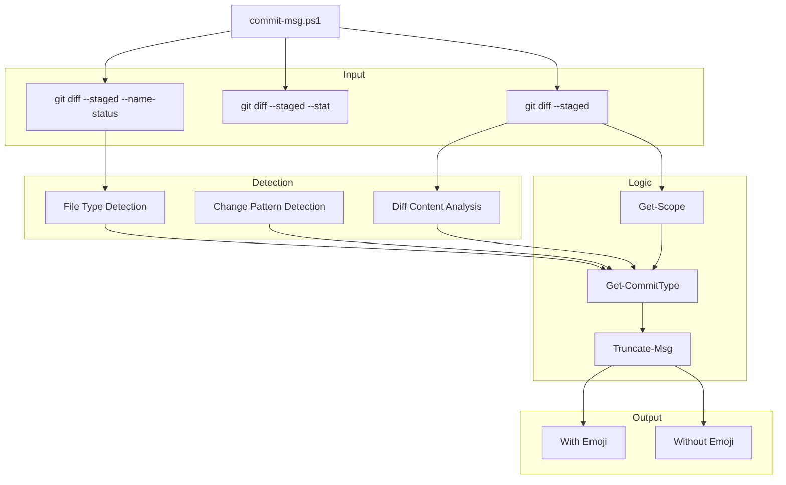
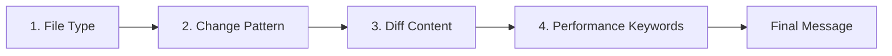

<p align="center">
  <strong>GitWhisper</strong>
</p>

<p align="center">
  <strong>Git + Text — The script whispers the right commit message.</strong>
</p>

<p align="center">
  
  
  
  
</p>

<p align="center">
  <a href="#preview">Preview</a> ·
  <a href="#features">Features</a> ·
  <a href="#quick-start">Quick Start</a> ·
  <a href="#commands">Commands</a> ·
  <a href="#architecture">Architecture</a> ·
  <a href="#tech-stack">Tech Stack</a>
</p>

---

Gitext is a PowerShell script that analyzes your `git diff` and auto-generates **[Conventional Commits](https://www.conventionalcommits.org/en/v1.0.0/)** messages with **gitmoji** support. It detects file types, infers scope from folder structure, and produces specific descriptions by reading the actual diff content.

## Preview

```
PS C:\MyProject> .\commit-msg.ps1

=== Changes detected ===

 src\auth\Login.js   | 12 ++++++++++
 src\api\user.js     |  5 +++--

=== Choose your commit message ===

  [1] ✨ feat(auth): adds Login component
  [2] feat(auth): adds Login component
  [3] ✨ feat(auth): adds Login import and handleSubmit
  [4] feat(auth): adds Login import and handleSubmit
  [0] Cancel

  Select (0-4): 1

  Committing: ✨ feat(auth): adds Login component

  Push to remote? (y/n): y

  Pushing...
  Pushed successfully!
```

## Features

| Feature | Description |
|---|---|
| Type Detection | Auto-detects feat, fix, docs, style, refactor, perf, test, build, ci, chore |
| Scope Inference | Reads folder structure to determine scope (auth, api, ui, etc.) |
| Specific Descriptions | Analyzes diff content for imports, functions, classes, hooks, routes |
| Gitmoji Support | Generates both emoji and non-emoji versions |
| Staged Only | Only analyzes what's staged (what will be committed) |
| PS 5.1 Compatible | Unicode escapes for full Windows PowerShell compatibility |
| 50/72 Rule | Enforces conventional commit summary length |

## Quick Start

### 1. Copy the script

```powershell
Copy-Item "commit-msg.ps1" -Destination "C:\MyProject\"
```

### 2. Stage your changes

```powershell
cd C:\MyProject
git add .  # or selectively add files
```

### 3. Run the script and choose

```powershell
.\commit-msg.ps1
# Select 1-4, then confirm push
```

## Commands

| Command | Description |
|---|---|
| `.\commit-msg.ps1` | Generate commit message and commit interactively |

## Architecture



### Detection Priority



| Priority | Detection | Example |
|---|---|---|
| 1 | File type | `.test.js` → test, `Dockerfile` → build |
| 2 | Change pattern | Added only → feat, modified only → fix |
| 3 | Diff content | `import { Login }` → adds Login import |
| 4 | Performance | `memo`, `lazy`, `cache` → perf |

## Commit Type Detection

| Type | Emoji | Detected From | Example |
|---|---|---|---|
| `feat` | ✨ | New files added | `feat(auth): adds Login component` |
| `fix` | 🐛 | Modified files, error handling | `fix(api): adds error handling in user.js` |
| `docs` | 📝 | `.md`, `.txt`, `.rst` files | `docs: adds README.md` |
| `style` | 💄 | `.css`, `.scss`, `.less` files | `style: fixes formatting in header.css` |
| `refactor` | ♻️ | Mixed add+modify+delete | `refactor: adds X and removes Y` |
| `perf` | ⚡ | Performance keywords | `perf: adds memo and lazy optimization` |
| `test` | ✅ | Test files (`.test.`, `.spec.`) | `test: adds tests for utils.test.js` |
| `build` | 🔧 | `package.json`, `Dockerfile` | `build: updates axios dependency` |
| `ci` | 👷 | `.github/workflows` | `ci: updates CI pipeline` |
| `chore` | 🔨 | Config files | `chore: updates configuration` |

## Scope Detection

The scope is automatically inferred from the folder structure:

```
src/
├── auth/          → scope: "auth"
├── api/           → scope: "api"
├── components/    → scope: "components"
└── utils/         → scope: "utils"
```

| Rule | Result |
|---|---|
| Single directory | Uses directory name as scope |
| Multiple directories | Picks the one with ≥60% of changed files |
| Single file | Uses filename without extension |
| Root-level files | No scope |

## Specific Descriptions

The script analyzes the **actual diff content** to generate precise descriptions:

| Diff Pattern | Generated Description |
|---|---|
| `import { Login }` | `adds Login import` |
| `function handleSubmit` | `adds handleSubmit` |
| `class UserService` | `adds UserService class` |
| `useState()` | `adds useState hook` |
| `<Route path="/api">` | `adds /api route` |
| `onClick={handleClick}` | `adds onClick listener` |
| `try { ... } catch` | `adds error handling` |
| `console.log()` | `adds logging` |
| `margin: 10px` | `adjusts CSS properties` |
| `fetch("/api")` | `adds API call` |
| `npm install axios` | `updates axios dependency` |

## Examples

### Adding a new component

```powershell
.\commit-msg.ps1
# Output: ✨ feat(auth): adds Login component in auth.js
```

### Fixing a bug

```powershell
.\commit-msg.ps1 -Staged
# Output: 🐛 fix(api): adds error handling in user.js
```

### Updating dependencies

```powershell
.\commit-msg.ps1
# Output: 🔧 build: updates axios dependency
```

### Adding tests

```powershell
.\commit-msg.ps1
# Output: ✅ test: adds formatCurrency test for utils.test.js
```

### Refactoring with mixed changes

```powershell
.\commit-msg.ps1
# Output: ♻️ refactor: adds formatPrice and removes legacy calculation from utils.js
```

## Tech Stack

| Component | Technology |
|---|---|
| Language | PowerShell 5.1+ / 7.0+ |
| Version Control | Git 2.0+ |
| Convention | [Conventional Commits 1.0](https://www.conventionalcommits.org/en/v1.0.0/) |
| Emoji | [Gitmoji](https://gitmoji.dev/) via Unicode escapes |
| OS | Windows, Linux, macOS |

## Project Structure

```
GitWhisper/
├── commit-msg.ps1          # Main script
└── README.md               # This file
```

### Script Sections

```
commit-msg.ps1
├── Parameters              # -Staged switch
├── Git Validation          # Checks for .git directory
├── Diff Parsing            # --name-status, --stat, content
├── File Classification     # Added, modified, deleted, renamed
├── Get-Scope               # Folder structure → scope
├── Get-CommitType          # Type + description detection
│   ├── Test Files          # .test., .spec.
│   ├── Config Files        # package.json, Dockerfile, etc.
│   ├── CI Files            # .github/workflows, .gitlab-ci
│   ├── Doc Files           # .md, .txt, .rst
│   ├── Style Files         # .css, .scss, .less
│   ├── DB Files            # migration, schema, .sql
│   ├── Diff Analysis       # imports, functions, classes, hooks
│   └── Fallback Patterns   # error handling, logging, CSS, etc.
├── Gitmoji Mapping         # Unicode escapes for PS 5.1
├── Message Builder         # type(scope): description
├── Truncate-Msg            # Enforce ≤50 chars
└── Output                  # With/without emoji versions
```

## Configuration

### Custom Gitmoji

Edit the `$gitmoji` hashtable in the script:

```powershell
$gitmoji["feat"] = [char]::ConvertFromUtf32(0x1F680)  # 🚀
$gitmoji["fix"]  = [char]::ConvertFromUtf32(0x1F525)  # 🔥
```

### Max Summary Length

The `Truncate-Msg` function enforces a maximum length (default: 50 chars):

```powershell
function Truncate-Msg {
    param([string]$Msg, [int]$MaxLen = 50)  # Change to 72 for longer summaries
    ...
}
```

## Compatibility

| Requirement | Version |
|---|---|
| **Windows PowerShell** | 5.1+ |
| **PowerShell Core** | 7.0+ |
| **Git** | 2.0+ |
| **OS** | Windows, Linux, macOS |

> **Note:** Emojis are generated using `[char]::ConvertFromUtf32()` for full compatibility with Windows PowerShell's default UTF-8 handling.

## License

MIT — use it, fork it, customize it.
